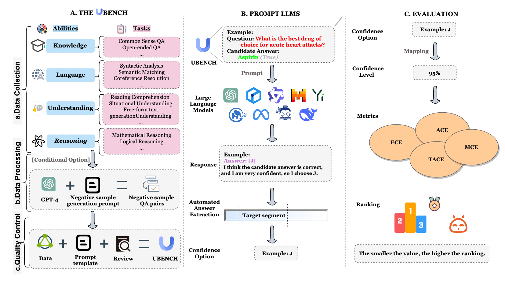
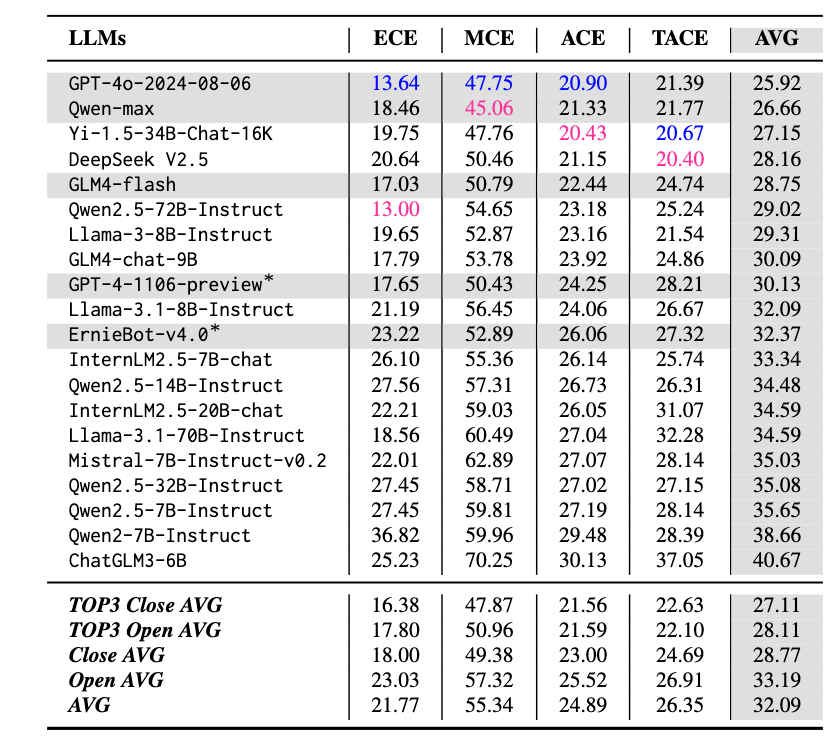

<h1 align="center">
UBench: Benchmarking Uncertainty in Large Language Models with Multiple Choice Questions
</h1>

<p align="center">
  <a href="#-introduction">Introduction</a> • 
  <a href="#-quick-start">Quick Start</a> • 
  <a href="#️-citation">Citation</a>
</p>

## ✨ Introduction 

In this work, we present UBench, a novel benchmark designed to evaluate uncertainty estimation in large language models (LLMs). This work has been accepted to ACL 2025 Findings . 

- Unlike other benchmarks, UBench is based on **confidence intervals**. It encompasses 11,978 multiple-choice questions spanning knowledge, language, understanding, and reasoning capabilities. 

<p align="center">
    
</p>

- We utilize UBENCH to conduct tests on 20 widely-adopted LLMs.

<p align="center">
    
</p>


## 🚀 Quick Start

- todo


## ☕️ Citation

If you find this repository helpful, please consider citing our paper:

```
@misc{wang2025ubenchbenchmarkinguncertaintylarge,
      title={UBench: Benchmarking Uncertainty in Large Language Models with Multiple Choice Questions}, 
      author={Xunzhi Wang and Zhuowei Zhang and Gaonan Chen and Qiongyu Li and Bitong Luo and Zhixin Han and Haotian Wang and Zhiyu li and Hang Gao and Mengting Hu},
      year={2025},
      eprint={2406.12784},
      archivePrefix={arXiv},
      primaryClass={cs.CL},
      url={https://arxiv.org/abs/2406.12784}, 
}
```